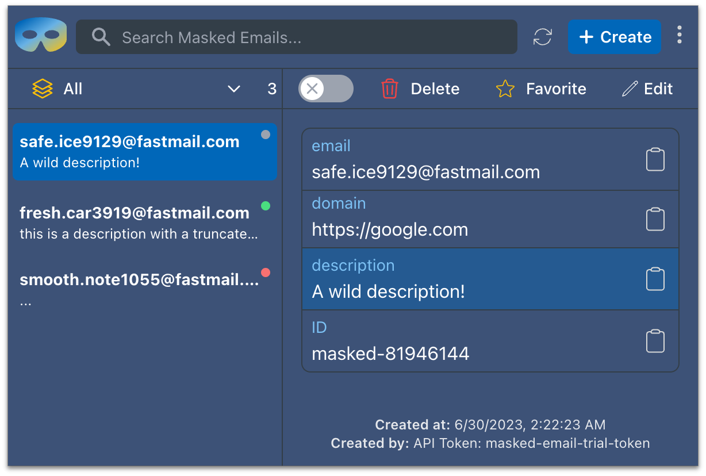

<h1 align="center">

Masked Email Manager
</h1>
<h3 align="center">
Manage your 
<a href="https://www.fastmail.help/hc/en-us/articles/4406536368911-Masked-Email">Fastmail Masked Emails</a>
</h3>

    

  
  
  
  
  

  
  

Masked Email Manager is a Chromium web extension that allows you to manage your [Fastmail Masked Emails](https://www.fastmail.help/hc/en-us/articles/4406536368911-Masked-Email).

# Installation
Install Masked Email Manager from the 
[Chrome Web Store](https://chrome.google.com/webstore/detail/masked-email-manager/bckfnibflpdgifdfkfoooidpblaembga)

# Features
- Create new Masked Emails
- Quickly view and copy your existing email details
  - Address
  - Description
  - Domain
  - Email ID
- Edit your existing emails
  - Description
  - Domain
- Delete your Masked Emails
- Fuzzy search across all email details including address, description, domain and email ID
- Filter by email state
  - Enabled
  - Disabled
  - Deleted
- Favorite your most used emails and filter by favorites

Check out the [wiki](https://github.com/ajyey/masked-email-manager/wiki) for more details on how to use Masked Email Manager and its features
